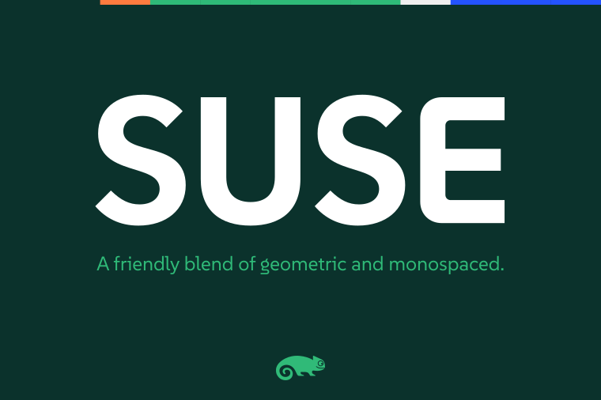
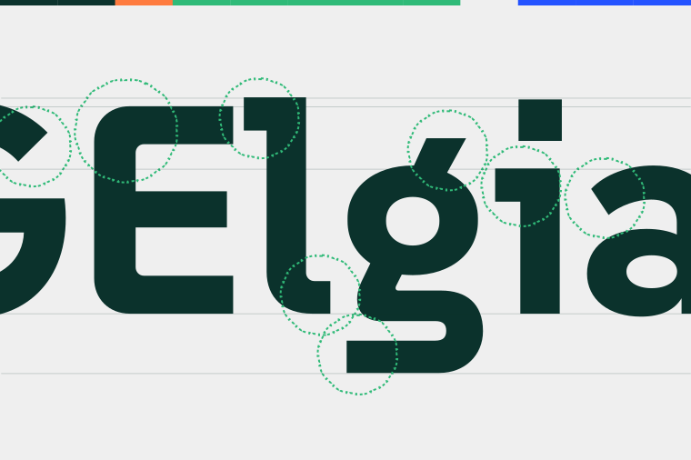
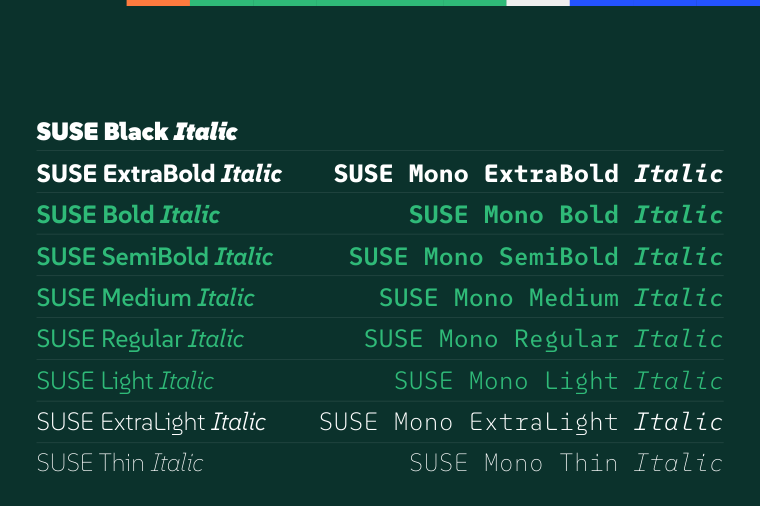

----

# SUSE

**SUSE** is a sans serif typeface designed by [René Bieder](https://www.renebieder.com/), embodying a unique hybrid between geometric and monospaced features. It captures the essence of SUSE, a company renowned for its open-source solutions. This versatile typeface family includes the following styles: Thin, ExtraLight, Light, Regular, Medium, SemiBold, Bold, and ExtraBold.

**SUSE** was created to reflect the innovative and open-source spirit of the SUSE company. It provides clarity and legibility, making it ideal for both digital and print media. The hybrid design combines geometric precision with monospaced stability, ensuring a modern and efficient aesthetic.

**SUSE** stands out with its distinctive design, perfect for modern, open-source, and tech-focused projects. Its variety of weights allows for flexibility in design, from headlines to body text, ensuring consistency and harmony across different use cases.

**SUSE** supports over 200 Latin-based languages.

## About

**We are SUSE.** We believe in building a future for secure, open source innovation.

## Credits

**Type designer** René Bieder

## Building

Fonts are built automatically by GitHub Actions - take a look in the "Actions" tab for the latest build.

If you want to build fonts manually on your own computer:

* `make build` will produce font files.
* `make test` will run [FontBakery](https://github.com/googlefonts/fontbakery)'s quality assurance tests.
* `make proof` will generate HTML proof files.

The proof files and QA tests are also available automatically via GitHub Actions - look at `https://github.com/SUSE/suse-font`.

## Changelog

**28 June 2024. Version 1.00**

- First release.

## License

SUSE typeface is licensed under the SIL Open Font License, Version 1.1.
This license is available with a FAQ at
https://scripts.sil.org/OFL

## Repository Layout

This font repository structure is inspired by [Unified Font Repository v0.3](https://github.com/unified-font-repository/Unified-Font-Repository), modified for the Google Fonts workflow.
